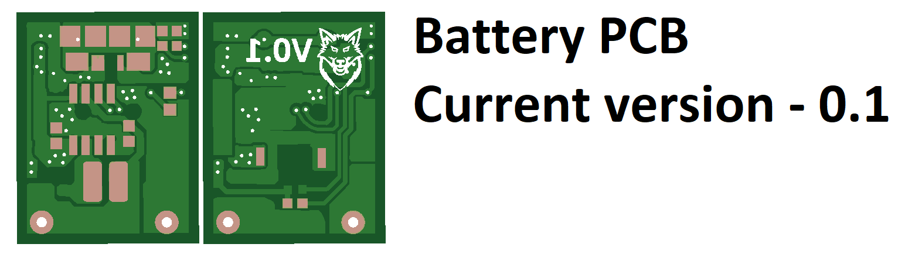

# My Custom Hardware List

# Gyro Core Version

# Regular Pro-Micro Version

# Pro-Micro USB-C Version

## Wiring the IMU and MCU
The IMU 

### Programming your Arduino board

As 

### Installing the SteamVR driver

Choos

### SteamVR Firmware installation video :
[![Sideloader SteamVR firmware installation]
